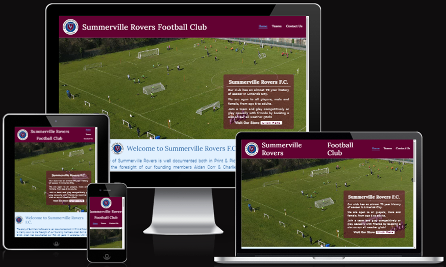
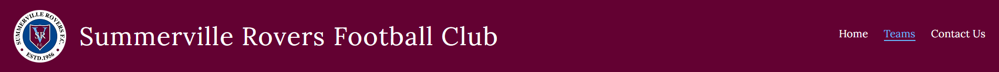
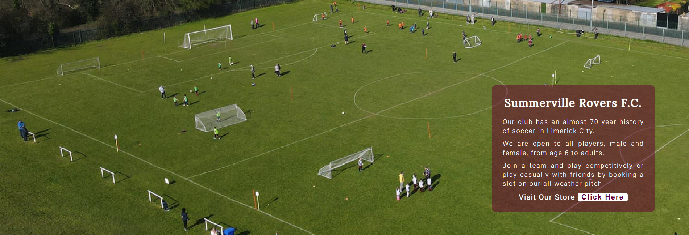
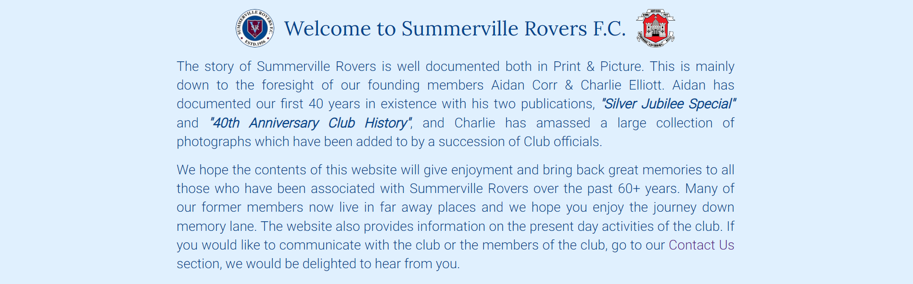
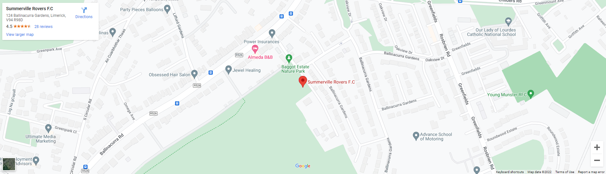
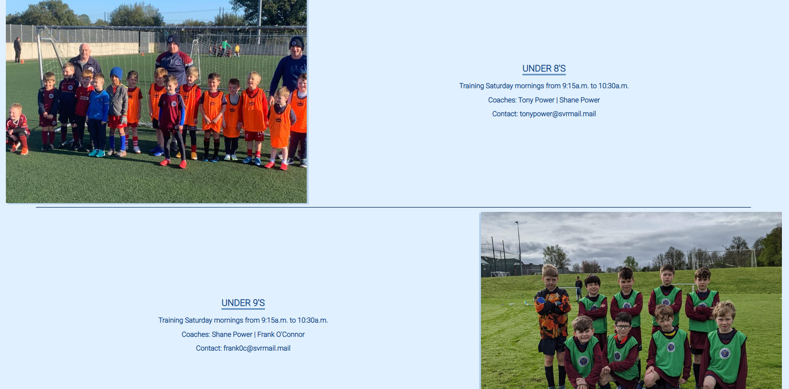

# Summerville Rovers F.C.

The aim of this project was to design a website for a local soccer club, Summerville Rovers F.C.

The club want a website to provide exposure for the club to help it grow and attract new members. The club want to provide a place for members and/or non-members to find information about the club and to be able to use the site for booking events or training slots on the pitches. As well as using the site for bookings, they also want to provide information on current teams, fixtures/results and league positions. Currently, players and members rely on external sources for information on league positions, fixtures and results. The club also wanted a gallery page showing the history of the club through old photos of the ground and teams.

The club would like, in the future, to implement their own online store to sell official club sports clothing and other items related to the club such as memorabilia and training equipment etc.
Currently this website is linked to an external store for this purpose.

## Features 

This section will look at the different features of the current website. The website has 4 pages including Home, Teams, Contact Us & Join.

The Home page contains 5 sections: -
  - Header
  - Animated hero image with cover-text box
  - Welcome section
  - Google Maps location
  - Footer with social media links

The Teams page includes images of all club teams with information on fixtures, results and league table.

The Contact Us page contains details of committee members with contact information for each as well as an option to book a slot on the all-weather pitch.

The Join page contains a background image of the grounds and a form to become a member of the club.

All pages contain the same header and footer.

### Existing Features

- __Navigation Bar__

  - Featured on all three pages, the full responsive navigation bar includes links to the Home, Teams and Contact Us pages, and is identical in each page to allow for easy navigation.
  - This section will allow the user to easily navigate from page to page across all devices without having to revert back to the previous page via the ‘back’ button. 

- __The Home page image__

  - The landing includes a photograph with text overlay to allow the user to see exactly which location this site would be applicable to. 
  - This section introduces the user to Summerville Rovers F.C. with an eye catching animation to grab their attention.
  - There is also button on the text overlay that brings the user to an external website where they can purchase club training gear and merchandise.

- __Welcome Section__

  - This section introduces the user to the club and talks a little bit about the club history.
  - There is also an option to take the user directly to the contact us page should they require more information about the club or any of its teams. 

- __Location section__

  - This section will allow the user to see exactly where the club is located using an embedded map from Google Maps. 
  - There is also the ability to get directions directly from the map by clicking on the directions link provided by Google. 

- __The Footer__ 

  - The footer section includes links to the relevant social media sites for Summerville Rovers.
  - Currently, the Facebook link is the only one that goes directly to the club's Facebook page as the club does not have any other social media accounts. The other social media links work but only take the user to the site login page. 
  - The footer is valuable to the user as it encourages them to keep connected via social media.

- __Teams__

  - The teams page has in image of each team from under 8's to both men's senior teams.
  - This section is valuable to the user as it provides a glimpse of some of the recent successes of the club's teams as well as providing information on training times and coaches.
  - The email addresses are not real currently but the club are looking into hosting the site online and all email addresses will be updated then. 

- __The Contact Us page__

  - This section allows the user to leave their contact details and a message for the club if any further information is required or if someone is looking at becoming a member.

### Features Left to Implement

- In the future the club hope to have their own online store
- A booking page for hiring the all-weather pitch or for events and tournaments

## Testing 

- Good results from Lighthouse test: -
[Lighthouse](assets/images/lighthouse.PNG)

### Validator Testing 

- HTML
  - One error returned but ran out of time to fix it or project submission would have been delayed [W3C validator](assets/images/html_validator.PNG)
- CSS
  - No errors were found when passing through the official [(Jigsaw) validator](assets/images/css_validator.PNG)

### Unfixed Bugs

- Some minor bugs at very small screen sizes.

## Deployment

- The site was deployed to GitHub pages. The steps to deploy are as follows: 
  - In the GitHub repository, navigate to the Settings tab 
  - From the source section drop-down menu, select the Master Branch
  - Once the master branch has been selected, the page will be automatically refreshed with a detailed ribbon display to indicate the successful deployment. 

The live link can be found here - https://ci-tom.github.io/PP1_Summerville-RoversFC/ 

## Credits 

- Most ideas are from the Code Institute Love Running Project and tried to change styling and content where possible.
- Some inspiration for header styling from https://youtu.be/p0bGHP-PXD4
- Contact form idea from https://youtu.be/524ycUqs3f0 and integrated some of the Love Running styling

### Content 

- The text for the Home page was provided by Summerville Rovers
- The icons in the footer were taken from [Font Awesome](https://fontawesome.com/)

### Media

- The photos used on the home page and teams page are from Summerville Rovers
- The image used for the contact us background was created in MS Paint by me.
